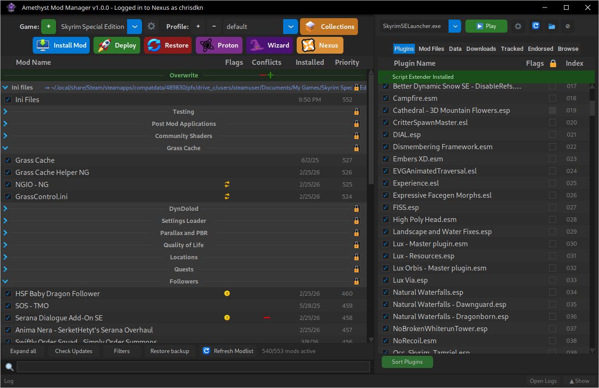

<p align="center">
    
</p>
<h1 align="center">Amethyst Mod Manager</h1>

<h3 align="center">A mod manager for Linux.</h3>

<p align="center">
    
</p>

## Key Features

- **Mod Organiser like interface** - Designed to look and behave like Mod Organiser
- **Collections** - Install Nexus Mods collections straight into the manager
- **Linux Native** — Designed for Linux
- **Multi-game support** — Support for many games
- **FOMOD support** — Full Fomod support with last selections saved.
- **LOOT support** — Plugins for games that use LOOT can be sorted using LOOT.
- **Nexus API Support** — Integration with features provided by the Nexus Mods Api
- **Root Folder builder** — Files placed in the managers root folder separator are deployed to the games root folder and cleaned up on restore.
- **Save runtime generated files** - Files generated by mods such as configs or shaders. Are moved back to the managers staging directory so settings are not lost

## Install

Run the following command in a terminal. It will appear in your applications menu under Games and Utilities.
**The Application may ask to set a password, This is for the OS keyring to store your nexus API key as we do not store it in a plain text file. Set the password to anything you want**

```bash
curl -sSL https://raw.githubusercontent.com/ChrisDKN/Amethyst-Mod-Manager/main/src/appimage/Amethyst-MM-installer.sh | bash
```

## Games Supported

<table>
<tr>
  <th>Game</th><th>Notes</th>
  <th>Game</th><th>Notes</th>
</tr>
<tr><td>Skyrim</td><td>Normal, SE and VR</td><td>No Mans Sky</td><td></td></tr>
<tr><td>Fallout 3</td><td>Normal and Goty</td><td>Resident Evil</td><td>2, 3, 4, 7, Village, Requiem</td></tr>
<tr><td>Fallout 4</td><td>Normal and VR</td><td>The Sims 4</td><td></td></tr>
<tr><td>Fallout New Vegas</td><td></td><td>TCG Card Shop Simulator</td><td></td></tr>
<tr><td>Enderal</td><td>Normal and SE</td><td>Supermarket Simulator</td><td></td></tr>
<tr><td>Starfield</td><td></td><td>Valheim</td><td></td></tr>
<tr><td>Oblivion</td><td></td><td>Lethal Company</td><td></td></tr>
<tr><td>Oblivion Remastered</td><td></td><td>Mount &amp; Blade II: Bannerlord</td><td></td></tr>
<tr><td>Morrowind</td><td></td><td>Slay The Spire 2</td><td></td></tr>
<tr><td>Baldur's Gate 3</td><td></td><td>Blade &amp; Sorcery</td><td></td></tr>
<tr><td>Witcher 3</td><td></td><td>Rimworld</td><td></td></tr>
<tr><td>Cyberpunk 2077</td><td></td><td>Green Hell</td><td></td></tr>
<tr><td>Mewgenics</td><td></td><td>Schedule 1</td><td></td></tr>
<tr><td>Stardew Valley</td><td></td><td>Ready Or Not</td><td></td></tr>
<tr><td>Kingdom Come Deliverance</td><td>1 and 2</td><td>Monster Hunter World</td><td></td></tr>
<tr><td>Hogwarts Legacy</td><td></td><td>Monster Hunter Rise</td><td></td></tr>
<tr><td>Marvel Rivals</td><td></td><td>Monster Hunter Wilds</td><td></td></tr>
<tr><td>Expedition 33</td><td></td><td></td><td></td></tr>
<tr><td>Subnautica</td><td></td><td></td><td></td></tr>
<tr><td>Subnautica Below Zero</td><td></td><td></td><td></td></tr>
</table>
- The manager has the ability to define custom games. See the Wiki for the guide

## Usage

1. Add a game with the **+** icon in the top left.
2. It should auto-detect your install path and Proton prefix, but you can change these if needed.
3. Change the staging directory if you wish — this is where your mods are stored.
4. Use the **Install Mod** button to install a new mod.  
   Optionally, you can install from the Downloads tab if the mod is in your downloads folder.
5. Sort your mods in the mod list panel. You can add separators to group them.
6. If using a LOOT-supported game, you can sort and move plugins in the Plugins tab.
7. Click **Deploy** to move the mods to the game folder, or **Restore** to undo this.
8. Run the game via your normal method, Steam/Heroic/Lutris. You can also run the game in the top right with the run exe button.

You can also add multiple profiles with different configurations — simply create/swap to that profile and deploy it.

## Additonal tips for Steam Deck

- You can add the manager to gaming mode by looking for it in the application menu, right click and add to steam. It will show up in gaming mode
- when deploying in either desktop mode or gaming mode, you launch the game via gaming mode without needing to press play through the manager. You only need to use the manager to manage your mods.
- In gaming mode, some windows may open in the background. To see these press the steam button and switch to it. There shouldn't be many of these that can show up

## Collections

The manager has the ability to add Nexus collections straight into the manager. Here's how it works:
- This feature only works for nexus premium users, There's no mechanism currently to manually download the mods.
- The collections page will show the top collections for the selected game, A url can be entered to a specific collection instead.
- When installing a collection they are downloaded in size order largest first
- They are then installed, also in size order, smallest first. The application may "freeze" while extracting large zip files. This is normal
- Some mods come with fomod settings, meaning the fomod menu is skipped for some mods. Some others will still pop up and need manual input.
- The authors load order is applied when the collection completes
- Collections are installed as separate profiles and can be switched between, letting you easily swap modlists.
- There are some limitations, Not all collections will work fully due to missing mods or our game handlers coming across a mod that has been shipped/packaged in an unusual fashion. Some may require some manual intervention to get to work.

## Supporting Applications

The manager supports many supporting applications used to mod games. Place the applications in the games applications folder (**In the staging folder**) and they will be auto detected. The arguments/config used to run them will be auto-generated to make setup easier.

**As of update 1.1.7 you can now run most of these tools from the wizard menu, the dependancies will auto install. The only manual step is downloading the application itself**

| Status | Application | Notes |
|--------|-------------|-------|
| Working | **Pandora Behaviour Engine** | `--tesv:` and `--output:` args applied at runtime|
| Working | **SSEEdit** | `-d` and `-o` args applied at runtime|
| Working | **pgpatcher** | Requires `d3dcompiler_47` and `.net8 desktop runtime` installed to the game prefix via Protontricks. Config auto generated to include Data directory and output folder |
| Working | **DynDOLOD** | `-d` and `-o` args applied at runtime|
| Working | **TexGen** | `-d` and `-o` args applied at runtime|
| Working | **xLodGen** | `-d` and `-o` args. Game argument appended at runtime |
| Working | **Bethini Pie** | Just works |
| Experimental | **Vramr** | Experimental python wrapper See wiki for instructions|
| Experimental | **Bendr** | Experimental python wrapper See wiki for instructions|
| Experimental | **ParallaxR** | Experimental python wrapper See wiki for instructions|
| Working | **Wrye Bash** | `-o` Auto generated for selected game at runtime |
| Broken | **Synthesis** | Needs looking into |
| Working | **Bodyslide and Outfits Studio** | Add as a mod > Deploy > refresh the exe list > Run the exe and it should work |
| Working | **Witcher 3 Script merger** | Game path added to config automatically |
| Working | **Witcher 3 Script merger Fresh and Automated Edition** | Game path added to config automatically. Requires .net 8 Runtime installed into the prefix |
| Maybe | **Npc plugin chooser** | Game paths are applied to config at runtime, Can't seem to generate npc portraits and has some problems under proton |

The other xedit applications for the other games also work as well as the quickautoclean applications.

## Wiki

See the wiki page for a detailed guide on how to the use the mod manager and its functions

## Supporting the project

- This is where I'd put a ko-fi link or something. Give your money to a more worthwhile cause. Your feedback is enough
